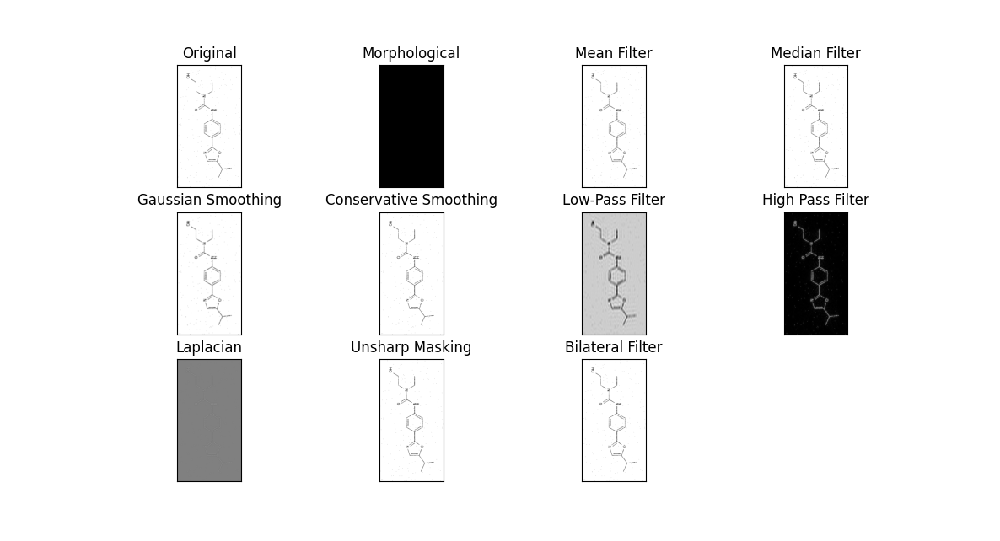
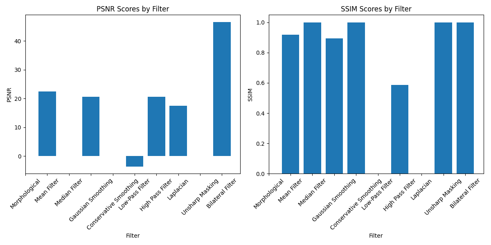
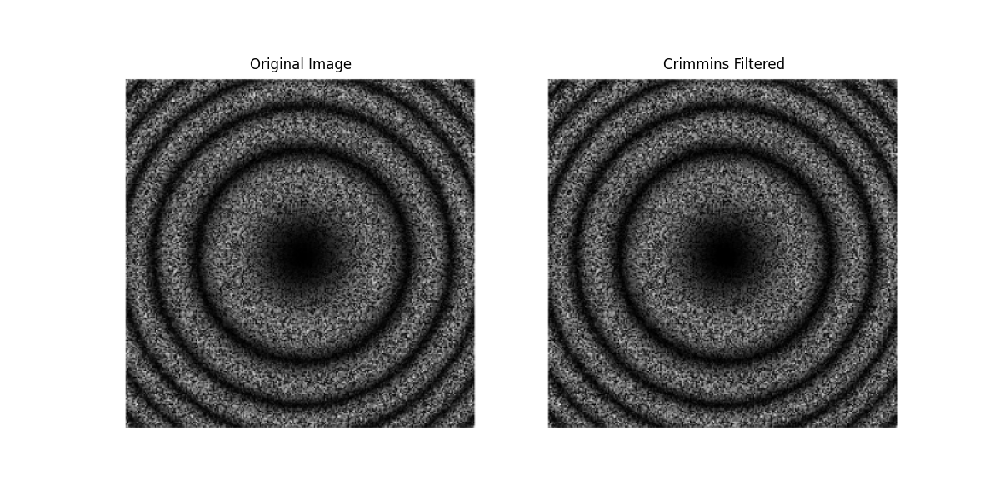
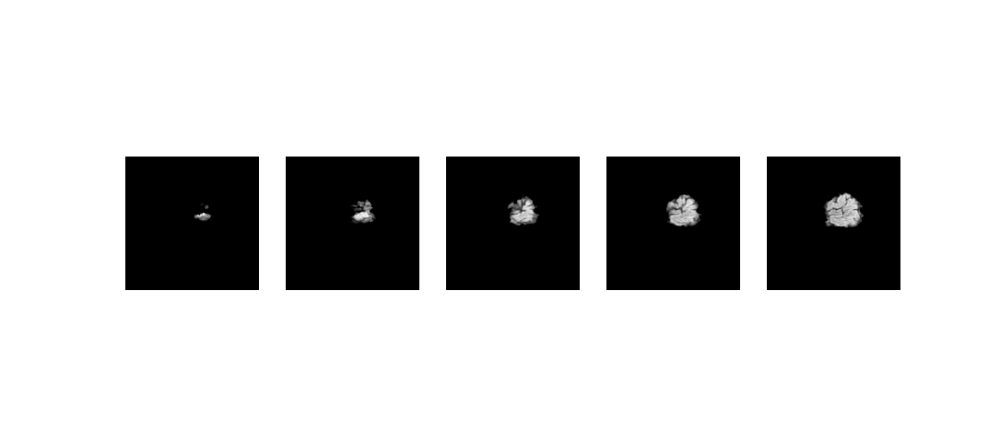

## Overview
This repo contains scripts of our assignment on digital image preprocessing. The repo is structured around three primary tasks: noise removal and reconstruction, speckle removal, and visualization of MRI data. The goal is to demonstrate various image processing techniques without the use of machine learning algorithms, focusing on practical applications like cleaning images, reconstructing details, and analyzing medical imaging data.


## Installation
### Prerequisites

- Python >= 3.9
- Libraries: OpenCV, NumPy, Matplotlib, PyDICOM (as needed)
- DICOM dataset provided by the RSNA (for MRI data visualization)


## Setup
To get started with this solution, clone this repository and install the required dependencies:

```
git clone https://github.com/ADA-GWU/a3-digital-image-processing-aliasgerovs.git
cd a3-digital-image-processing-aliasgerovs
pip install -r requirements.txt
```

## Tasks and Usage

1. Noise Removal and Reconstruction

For images in the noisy/chemical folder:

- Applying various filtering techniques to remove noise and reconstruct the shapes.
- Analyzing the effects of different filters and determine the best and worst among them.

```
python noise_removal.py --number_of_images <N>
```

Where <N> specifies the number of images to process. For example, --number_of_images 3 processes the first three images in the folder.



Scores.



2. Speckle Removal

For images in the noisy/speckle folder:

- Selecting techniques to clean speckle noise from the images.

Example command:

```
python speckle_removal.py --number_of_images <N>
```

Replace <N> with the number of images you intend to process.



3. Visualization of MRI Data

- Describing the contents and metadata of DICOM files.
- Visualizing different layers of MRI images.

Example command:

```
python mri_visualization.py
```


